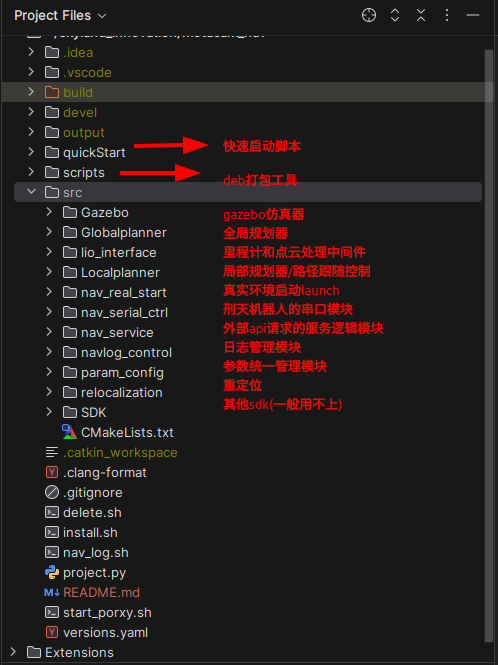
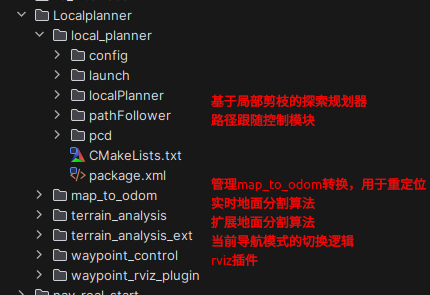
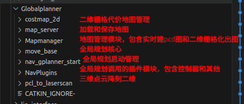

# Introduction

metacam_nav 依赖外部里程计输入的机器人自主规划导航代码仓库

# Compile

1. 安装配置依赖

```bash
bash ./quickStart/config_simulator.sh
```

2. 编译选项

- 编译仿真器和调试模式

```bash
catkin_make -DBUILD_SIMULATOR=ON -DCMAKE_BUILD_TYPE=Debug
```

- 编译实际发布版本

```bash
catkin_make -DCMAKE_BUILD_TYPE=Release
```

# Start

> 可以查看./quickStart/all_run.sh 的内容观察启动的对应launch文件内部结构

1. 快速调试——配置快速启动终端命令

```bash
source ~/.bashrc
```

启动命令介绍：

` sentry_run `  :基于rmuc地图的仿真。

额外选项：

- -q   : use relocalization
- -m  : use_global_planner && no_gazebo_map
- -s    : use nav_service
- -k    : use_global_planner && rmuc2024
- -r    : use_real_robot

注意：-k -r -m 这三个只能三选一来启动环境

示例：以下启动带顶层服务、全局规划器。但不加载gazebo仿真环境（常用于对实地建的用户地图进行仿真测试）

```bash
sentry_run -s -m
```

2. 在实车上运行

```
roslaunch nav_real_start nav_real_start.launch
```

# Workspace introduction



## Localplanner

局部规划器基于cmu开源的exploration框架进行二次开发。



## Globalplanner

全局规划器基于move_base框架进行二次开发



## Topic chain


