# Introduction

metacam_nav 依赖外部里程计输入的机器人自主规划导航代码仓库

# Compile

1. 安装配置依赖

```bash
bash ./quickStart/config_simulator.sh
```

2. 编译选项

- 编译仿真器和调试模式

```bash
catkin_make -DBUILD_SIMULATOR=ON -DCMAKE_BUILD_TYPE=Debug
```

- 编译实际发布版本

```bash
catkin_make -DCMAKE_BUILD_TYPE=Release
```

# Start

> 可以查看./quickStart/all_run.sh 的内容观察启动的对应launch文件内部结构

1. 快速调试——配置快速启动终端命令

```bash
source ~/.bashrc
```

启动命令介绍：

` sentry_run `  :基于rmuc地图的仿真。

额外选项：

- -q   : use relocalization
- -m  : use_global_planner && no_gazebo_map
- -s    : use nav_service
- -k    : use_global_planner && rmuc2024
- -r    : use_real_robot

注意：-k -r -m 这三个只能三选一来启动环境

示例：以下启动带顶层服务、全局规划器。但不加载gazebo仿真环境（常用于对实地建的用户地图进行仿真测试）

```bash
sentry_run -s -m
```

2. 在实车上运行

```
roslaunch nav_real_start nav_real_start.launch
```

# Workspace introduction

## Localplanner

局部规划器基于cmu开源的exploration框架进行二次开发。

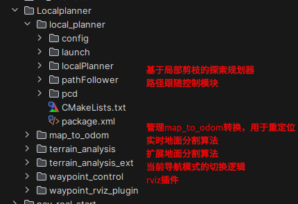

### 剪枝局部规划器

主要订阅者：

- 里程计——/odom_interface
- 地面分割后的障碍物点云——/terrain_map
- 局部目标点——/way_point

主要发布者：

- 局部规划的目标路径——/local_path
- 经过滤除和筛选后实际参与剪枝的障碍物点云——/PannerAtuCloud
- 构造的膨胀点云——/add_points

该剪枝规划器的核心思想：基于matlab实现生成一周36个方向重复的密集扇形三次样条曲线，然后根据实际场景中遇到的障碍物信息，对这种各个方向上的先验路径进行堵塞剪枝，最后再在剩下的所有可行路上进行评分函数的评分（包括车头权重、目标点方向权重、地面平整度权重）。

局部规划器的文件结构，核心代码具有完备的代码注释，可以自行理解和查看。

**注意**：部分函数或功能在实际使用中没有进行开启。

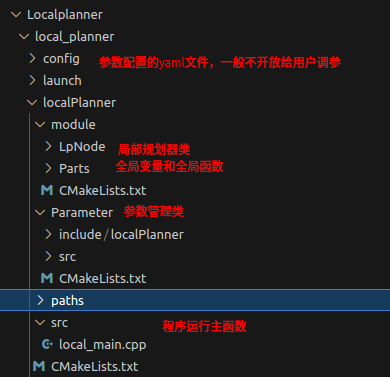

<center>剪枝规划器代码文件结构</center>

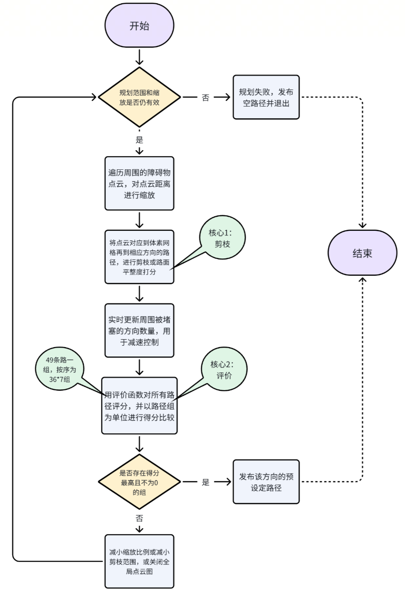

<center>剪枝规划器的程序流程图<center/>

### 线角速度路径跟随模型pathFollower

一. 订阅发布。

主要订阅者：

- 里程计——/odom_interface
- 地面分割后的障碍物点云——/terrain_map
- 局部路径——/local_path
- 外部要求强制停止——/stop
- 局部目标点——/way_point
- 决策器发布的当前控制模式——/control_mode

主要发布者：

- 是否已到达目标点——/get_goal
- 当前行走速度——/speed
- 对外的控制速度——/cmd_vel

二. 注意事项。

这部分的代码不涉及相关数学计算和复杂逻辑，简单阅读源码后基本可以完全理解完整的实现过程。

其中需要注意的：

1. pctlPtr->get_params().use_map参数

是否开启全局规划，若开启全局规划，路径跟随器会在存在全局路径时对全局路径进行跟踪；当不存在全局路径时会对局部路径进行跟踪。具体的切换逻辑还会涉及到与waypoint_control（规划模式决策器）的交互。

2. pctlPtr->get_params().use_virtual_head参数

这个参数在目前metacam相关所有产品中均置为false，该参数存在的目的主要是为了适应全向轮或者舵轮底盘等没有唯一车头的底盘设置虚拟车头，实现更高效的运动控制。

3. pctlPtr->get_params().useCloudSlowDown参数

是否根据周围的障碍物情况，进行一定的减速控制，以确保安全。这个参数一般来说都是置true。

三. 路径跟随方式。

对于路径的跟随方式涉及到另外三个核心的节点：/move_base、/localPlanner、/waypoint_control

1. 无图导航跟踪仅1米长的局部路径：

/localPlanner会不停地规划并输出局部路径。当pathFollower的pctlPtr->get_params().use_map参数为false时，或者/waypoint_control发布的规划模式为GOALDIRECT时，即为纯无图导航模式。pathFollower会跟踪20hz频率规划的/localPlanner输出的1米长局部路径，进行无图的探索。

2. 有图导航下的全局路径指引+无图导航灵敏避障模式。

此模式需要src/Localplanner/local_planner/config/tita.yaml下的goal_path_direct参数置为false。

适合在地图场景较大或因为设备算力不足等原因，导致全局路径的规划和发布频率较低时，如果直接跟踪全局路径，无法达到较好的避障效果。在此引导模式下，/move_base全局路径的生成——/waypoint_control确定当前的规划模式——给/localPlanner发布引导点——pathFollower跟踪的路径仍然是无图导航规划出来的局部路径，但是该路径是受全局规划引导的结果。

3. 有图导航下的全局路径直接跟随。

此模式需要src/Localplanner/local_planner/config/tita.yaml下的goal_path_direct参数置为true。

在全局规划更新频率的允许下，全局规划会随着动态障碍物更新进入全局代价地图，全局路径会不断地自行调整。如果更新频率达到预期，直接跟踪全局路径可以免受/localPlanner剪枝算法规划缺陷的影响，障碍物碰撞半径和路径的跟踪完全以平滑的全局规划路径为准，这样在一定程度上可以达到更丝滑和更精准的运动控制。

### map_to_odom功能包

该功能包管理/odom到/map坐标系的变换。其中/odom是slam算法里程计输出的父坐标系，/map坐标系是全局的地图坐标系。将里程计坐标系和全局坐标系分开管理可以达到随时调整车体初始位置的目的。该功能包主要是为relocalization重定位功能做重定位调整位姿使用。

### terrain_analysis和terrain_analysis_ext

1. terrain_analysis

这是cmu开源的地面分割算法，整体思路是将dis*dis大小的区域进行栅格化管理（dis的大小可以自行调整，一般为5到10m即地面分割的范围），然后在收到雷达点云时，将点云高度在相应的点云位置中进行记录，然后针对所有点云的进行相邻一圈（3×3即周围8个栅格）插值当前点云同样的高度值。最后在每个栅格上做相对高度比较，高度最低或者1/4等位置的点云高度即为当前栅格下点云的离地高度，该高度赋值给点云intensity值。

2. terrain_analysis_ext

这是扩展地面分割算法，在terrain_analysis的基础上，进行点云连接的连续性分析，目的是时地面分割支持的范围更远，一般是为了全局代价地图的更新而服务，局部地图无需远范围的地形信息。

### waypoint_control规划模式决策器

主要逻辑，该图绘制时间较老，部分如TRANSVERSE模式名称改为RECOVER模式。

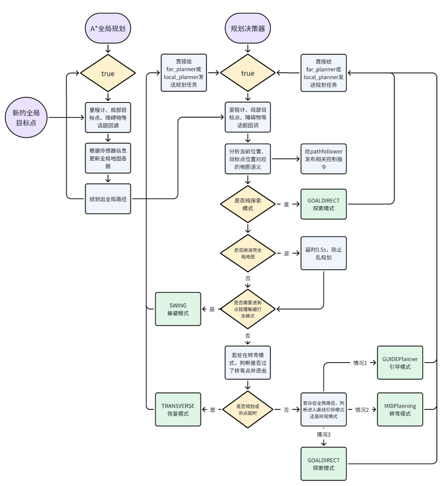

其中RECOVER模式目前主要用来管理地图的清理机制，以及清理可能存在的转弯点，该模式不太稳定，目前一般不启用。

## Globalplanner

全局规划器基于move_base框架进行二次开发

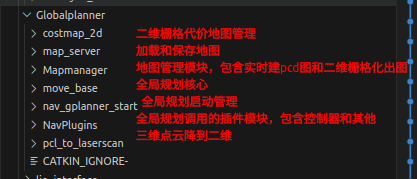


对于该框架，已关闭该框架下的所有局部的控制器。仅使用move_base中的代价地图维护和A*规划算法。

### Mapmanager地图管理模块

1. 实际场景中的地图创建nav_map_create.launch

```
<launch>
  <arg name="use_rviz" default="false" />

  <node pkg="map_manager" type="nav_map_create" name="nav_map_create" output="screen">
    <param name="record" value="true" />
    <param name="leaf_size" value="0.1" />
    <param name="pcd_path" value="$(find map_manager)/pcd/" />
    <param name="visual_pcd_path" value="$(find map_manager)/pcd/terrain20211227_17_16.pcd" />
    <param name="use_sim_time" value="false" />
    <param name="obstacleHeightThre" value="0.15" />
    <param name="save_always" value="true" />
  </node>

  <!-- 启动rviz -->
  <group if="$(arg use_rviz)">
    <node launch-prefix="nice" pkg="rviz" type="rviz" name="rvizGA"
      args="-d $(find vehicle_simulator)/rviz/robot_simulator_Sentry.rviz" respawn="true" />
  </group>

</launch>
```

在自主导航程序正常启动的前提下(即nav_real_start.launch)文件正常运行时，运行以上launch文件，其中注意record参数一定要true才能正常的记录地图。程序会正常对点云进行积分。其中/terrain_map_pub话题发布的是实时积分的地形点云(没有做动态障碍物滤除，容易受走动的人流影响)；/cloud_map_pub话题发布的是实时积分的全部点云，一般用来给重定位用。

建图过程中会不断输出.pcd文件，其中relocal是给重定位用的完整点云地图，terrain是给规划避障用的地形点云地图。

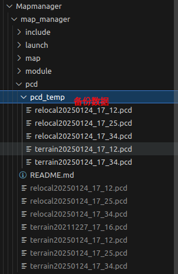

2. pcd_to_pgm.launch点云图转pgm二值化图

```
<launch>
    <!-- <arg name="cloud_in_topic" default="/map_flie_pub" /> -->
    <arg name="cloud_in_topic" default="/terrain_map_pub" />    

    <include file="$(find map_manager)/launch/interface/octomap_server.launch">
        <arg name="cloud_in_topic" value="$(arg cloud_in_topic)" />
    </include>
</launch>
```

在运行前可能需要调整以下launch文件的参数：

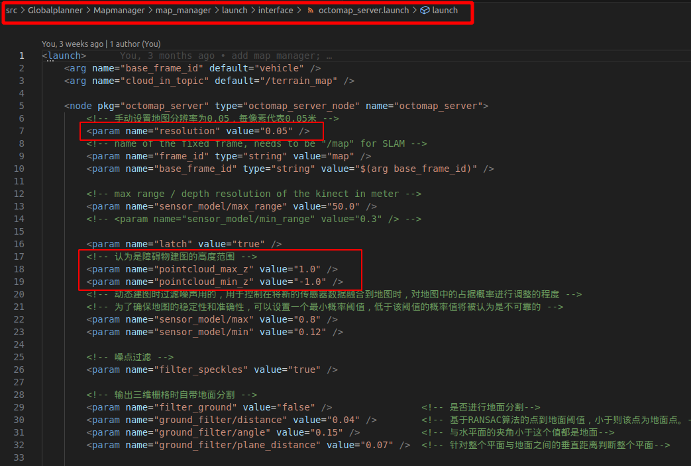

如图所示，在正在建图到末尾的时候（nav_map_create.launch仍然在运行），运行pcd_to_pgm.launch，其中cloud_in_topic设置为/terrain_map_pub。即可将实时积分得到的地形图转成pgm图，但是此时pgm图还没有保存。

3. 保存pgm地图save_map.launch

在前两步的launch文件一直运行的前提下，运行save_map.launch

```
<launch>
    <arg name="map_topic" default="/projected_map" />
    <arg name="save_file" default="$(find map_manager)/map/temp" />
    <arg name="occ_thresh" default="90" />
    <arg name="free_thresh" default="0" />

    <node pkg="map_server" type="map_saver" name="save_map" output="screen"
        args="--occ $(arg occ_thresh) --free $(arg free_thresh) -f $(arg save_file)">
        <remap from="map" to="$(arg map_topic)" />
    </node>
</launch>
```

可以通过save_file参数设置保存的pgm地图路径和名称。默认下会保存到以下位置

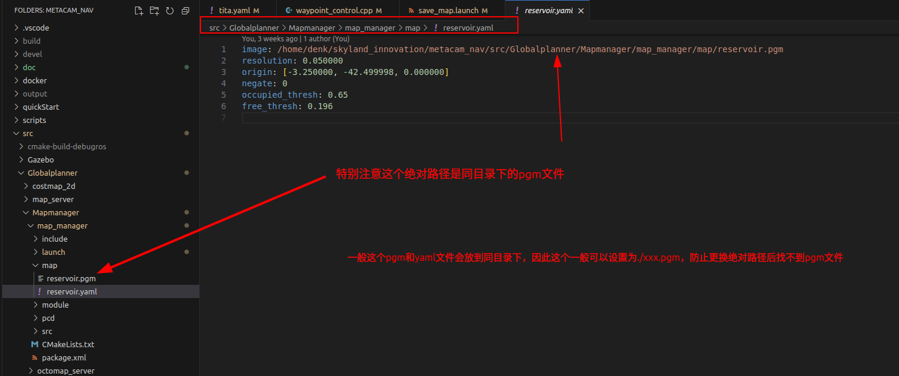

### system_gplanner全局规划启动

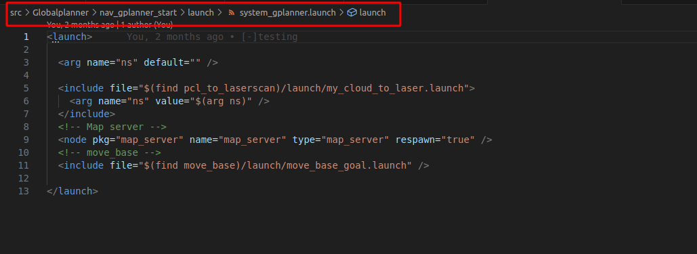

目前用到的所有全局规划相关的代码，启动此launch文件即可。

其他部分的代码，主要都是开源库拉下来做了小部分的改动，还没有进行较为完整的整理和手动加注释，后续需要维护的话可以自行查看源码。

### pcl_to_laserscan三维点云转二维点云

订阅/terrain_map即地面分割后的地形点云，会根据src/param_config/config/nav_config.yaml参数文件中的obstacleHeightThre参数作为分割阈值，将三维点云转成模拟的二维激光点云，最终输入到move_base进行二维平面的全局路径规划。


## param_config用户参数管理功能包

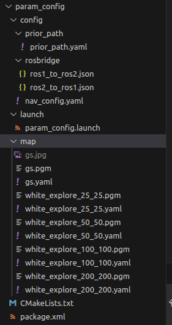

在此功能包下统一管理提供给用户修改的所有参数。

1. prior_path.yaml

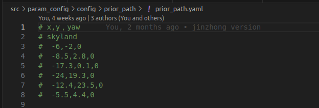

当nav_service判断当前为先验路径自主巡检模式时，会根据该文件中的点序列进行自主循环巡检。

2. rosbridge文件夹

底下的两个json暂时没有使用，也没有什么意义。

3. nav_config.yaml

里面的参数都有完善的注释。

4. map文件夹

用于全局路径规划的全局先验地图。具体使用和含义参见move_base系统。

## TopService顶层服务文件

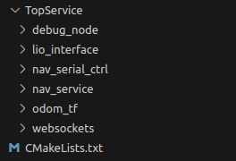

### nav_service

最核心的上位机文件，对接手机端app和网页api接口，同时根据需求也会对接debug_node功能包下的json文件管理的导航模式。主要用于根据外部api的输入，控制当前导航的模式、导航的目标点、是否需要重定位等。

主要发布者。

- 全局目标点——/move_base_simple/goal
- 强制停车——/stop
- 导航状态——/nav/status
- 请求发起一次重定位——/need_reloc

主要订阅者。

- 里程计——/odom_interface
- 重定位回传的位姿——/relocalization
- odom坐标系到map坐标系的变换——/odomToMapPose

主要服务通信的订阅者。

- 配置导航模式和状态——/nav/update_config
- 请求导航开始——/nav/start
- 请求导航停止——/nav/stop

导航模式相关

- 手机app或网页api控制。

先call请求/nav/update_config服务，并rosparam set /nav/config，此时可以配置导航模式或目标点相关的所有信息。

再call请求/nav/start服务，即可按照示教点进行导航。

以下为rosparam set /nav/config的相关json文件，mode是导航模式，parameters的第一个参数是导航点序列的循环次数，余下的是导航点序列。

```
{
  "mode": 2,
  "parameters": [
    2
  ],
  "points": [
    {
      "x": 4,
      "y": 9.0,
      "z": 0.0
    },
    {
      "x": 4.0,
      "y": 6.0,
      "z": 0.0
    }
  ]
}
```

- 利用debug_node节点进行控制。

改好以下路径下的json文件进行配置，然后 ` roslaunch debug_node debug_node.launch `即可。

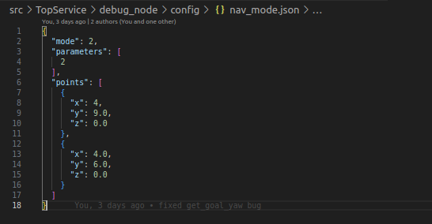

其中mode=0代表交给app或网页api控制，mode=1代表停止（和/nav/start服务一致），mode=2代表启动（和/nav/stop服务一致）。

### odom_tf和websockets

这两个功能包的存在是为了在使用docker部署程序时，进行本机和docker的通信和slam算法(metacam)中mapping_init到body坐标系之间的tf转换关系补足。

为什么使用docker部署？

1. 目前的代码是基于ros1进行编写的，由于时间问题，没能开发出ros2的版本。而因为skyland设备上的算力有限，导航算法一般应该部署在对应机器人底盘的高算力平台上，如果该平台是ros2的，那就需要使用docker进行部署。
2. 使用docker进行打包和部署可以避免对本机环境的破坏，更随意的定制化自己的部署环境。

### lio_interface

该功能包主要是作为slam输出的里程计和点云数据进行中转处理。目的：适应重定位发起后，点云在map上的坐标系问题和调整后车体里程计的发布。

## navlog_control日志管理

该日志管理功能包，基于spdlog库进行了二次封装，封装出了：

```
# CMAKE_BUILD_TYPE=Release时生效
NAV_WARN
NAV_PASS
NAV_INFO
NAV_HIGHLIGHT
NAV_ERROR

NAV_WARN_ONCE
NAV_PASS_ONCE
NAV_INFO_ONCE
NAV_HIGHLIGHT_ONCE
NAV_ERROR_ONCE

# CMAKE_BUILD_TYPE=Release时生效
DEBUG_NAV_WARN
DEBUG_NAV_PASS
DEBUG_NAV_INFO
DEBUG_NAV_HIGHLIGHT
DEBUG_NAV_ERROR
```

其中后缀带Once的函数每次调用都会打印，而一般的NAV_WARN会在同一个位置调用30次才会打印，DEBUG_NAV_WARN会在同一个位置调用150次才会打印，目的是降频打印，减少重定向到文件的日志过于庞大，同时降低终端日志刷新速度便于查看。

全部的打印消息都会重定向到：

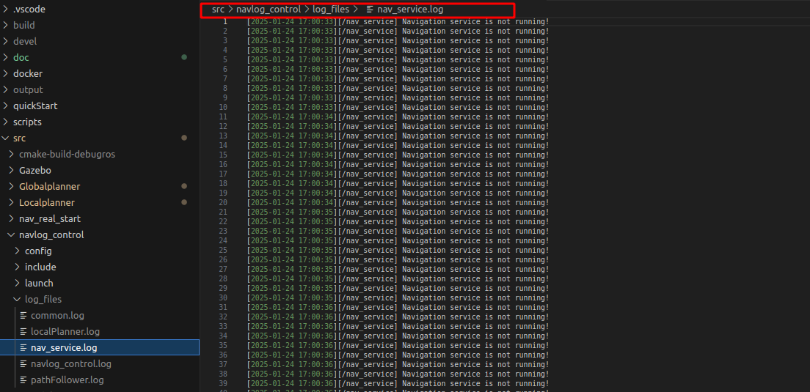

调用方法：

1. cmake链接nav_spd_log库

```
target_link_libraries(navlog_control
        nav_spd_log
)
```

2. 包含头文件

```
#include "navlog_control/spd_logging.hpp"
```

3. 初始化ros节点信息到日志类内

再main()函数中调用。

```
INIT_NAVLOG_ROS();
```

如此，ros节点名称会自动传入类内，日志就会以节点名称的方式重定向到log_files中<节点名称>.log文件中，否则统一重定向到common.log文件中。

# Optimization Direction

## 路径跟随和控制

目前的路径跟随模块是基于cmu开源的线角速度根据实际效果和需求进行大量的魔改而来，优点是简单灵活可以快速的适应实际需求进行改动；但本质上仍然是非闭环、不完备的控制方案，在控制器的设计上仍然任重道远。

## 规划算法

目前上车导航效果最好方案是，全局规划引导局部规划的方案，即有图导航引导无图导航。cmu的局部规划算法由于本身具备一定的探索规划能力，可以在全局路径失效或者周围路况复杂的时候快速自主探索绕障，但问题是容易陷入局部最优同时基于探索的方法欠缺目的性容易出现意料之外的导航行为。

在我(ldq 2025.2.14)看来：

1. 使用无图的探索规划算法进行兜底还是十分有意义的，但是无图导航的行为仍然需要更多的条件进行约束或者尝试开发出规划能力更好的无图规划算法。

2. 在拥有全局路径的前提下，仍然使用全局路径引导无图探索算法的方案会使全局路径的领导能力降低。即拥有先验全局路径的前提下，应该配备更加贴近和适应全局路径的局部路径预测生成算法来进行控制和跟踪。因此应该为有图导航设计一个更有的局部规划算法。
3. 全局规划算法设计到的全局代价地图维护应该更加的智能和鲁棒。什么时候清理地图，什么样的障碍物应该或不应该加入全局地图，这些都是十分价值的优化方向。
4. 全局规划算法目前采用的是最简单的A*搜索，有图metacam_nav应对的部分项目和业务需要大场景，因此对搜索算力要求比较苛刻，因此更换更高效的全局搜索算法也十分有必要。
5. 全局规划的有效性必须要求点到点之间在先验地图上找到一条通路，加入重定位效果不佳或者初始点位摆放不正、动态点云的加入都有可能导致得不到一条有效的全局路径，这时候要么进入无图的探索算法，要么就让车呆在原地。因此点位的修正或其他方法能让通路的获取更加的鲁棒，这是一个很值得思考和优化的问题。

## navlog_control

目前的日志管理工具，只完成了打印消息重定向到文件的功能。还有rosbag的自动录取和内存释放相关未完成。在开发过程中，如果产品对外发布了，客户会反馈各种的问题，此时如果没有一个有效的复盘日志，那只能在客户的反馈下一声声无奈的叹息。在我看来，日志和复盘工具对一个产品来说是非常关键的功能，希望能够着重去完善这一点。

# Other

ldq 2024.2.14.

感谢在无穹度过的半年时光。希望后续接手我工作的无穹人能够更多的从软件层面去优化和开发，尽量减少在硬件上耽误时间和出错。在这里，有十分难得的亲切感和和谐氛围，如果你也是一个经验欠缺的本科实习生，希望你不要一味埋头于技术上的进步和工作上的研究，也要更多的去感受这里的人和事，抓住每一个增长见识的机会。阅历上丰富是我在这里最大的收获，前路漫漫，步履不停，此去经年，愿是美景良辰。
